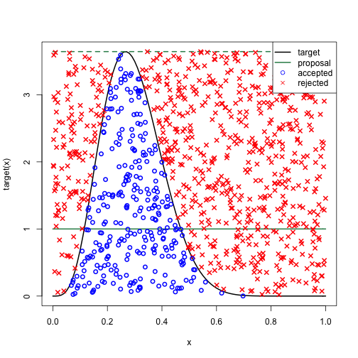

# Atoms
## Schrödingers equation


The [Hamiltonian($\hat{H}$)](https://en.wikipedia.org/wiki/Hamiltonian_(quantum_mechanics)) is the operator that represents the systems total energy, consisting of the kinetic($\hat{T}$) and potential($\hat{V}$) energy.
The hamiltonian defines the differential equation that is schrödingers equation. Solving it gets us the allowed energies E and the electrons wavefunction $\psi$.


### Solution Hydrogen atom
Solving Schrödingers equation using the hydrogen atoms hamiltonian($\hat{H}$) results in a wavefunction where the probability can be separated into a radial $R_{n\ell}(r)$ and an angular part $Y_\ell^m(\theta,\phi)$. Multiplying these together gives the wavefunction. ${\displaystyle \Psi _{n\ell m}(r,\theta ,\phi )=R_{n\ell}(r)Y_{\ell }^{m}\!(\theta ,\phi )}$

<br><br>The radial probability can be expanded into:
$$
R_{n\ell}(r) =
\underbrace{
\sqrt{\left(\frac{2}{na_0}\right)^3 \frac{(n-\ell-1)!}{2n[(n+\ell)!]}}
}_{\text{Normalization}}
\;
\underbrace{
e^{-r/(na_0)}
}_{\text{Exponential decay}}
\;
\underbrace{
\left(\frac{2r}{na_0}\right)^\ell
}_{\text{Power term}}
\;
\underbrace{
L_{n-\ell-1}^{2\ell+1}\!\left(\frac{2r}{na_0}\right)
}_{\text{Associated Laguerre polynomial}}
$$
Normalization: Makes the total probability of finding the electron anywhere = 1<br>
Exponential decay: Makes it less likely to find electron at large r <br>
Power term: Determines shape near nucleus<br>
Associated Laguerre polynomial: Adds nodes(where probability = 0)<br>


<br><br>The anglar probability can be expanded into:
$$
Y_\ell^m(\theta,\phi) =
\underbrace{
(-1)^m
}_{\text{Phase factor}}
\;
\underbrace{
\sqrt{\frac{2\ell+1}{4\pi} \frac{(\ell-m)!}{(\ell+m)!}}
}_{\text{Normalization}}
\;
\underbrace{
P_\ell^m(\cos\theta)
}_{\text{Associated Legendre polynomial}}
\;
\underbrace{
e^{im\phi}
}_{\text{Azimuthal phase}}
$$

Phase factor: Ensures consistent definitions for all harmonics <br>
Normalization: Ensures angular probability integrates to one over sphere<br>
Associated Legendre polynomial: Determines the shape <ins>along</ins> the Z-axis<br>
Azimuthal phase: Determines nodes in the XY-plane. I.e how the wavefunction "twists" <ins>around</ins> the Z-axis. 

### Born's rule
[Born's rule](https://en.wikipedia.org/wiki/Born_rule) states, amongst other things, that squaring the absolute value of $\psi$ gives us the probability density for finding a particle in a certain position. ${\displaystyle p(x,y,z)=|\psi (x,y,z,)|^{2}.}$


### Recurrance relation
A mathematical concept where immediately calculating a function of a certain X is complex, but sequentially calculating your way to it using initial conditions is easy. E.g The fibonacci sequence

## Lagurre polynomial
[Lagurre's polynomials](https://www.youtube.com/watch?v=IFH27Ukbpfo) are solutions to the radial part of schrödingers equation when it able to be divided into angular and radial. They are calculated using recurrance and a set of inital solutions. They express the probability of the electron in respect to its distance from the nucleus and are hence the cause of the radial nodes.  

## Legendre polynomial 
[Legendres polynomials](https://www.youtube.com/watch?v=17AaRCeejh8) calculates the angular part of the spherical harmonics that electron probabilities look like. It only takes into account the value n(m = 0), meaning the probability only depends on theta.

### Legendre associated polynomial 
Much the same as legendre's polynomial, [however](https://en.wikipedia.org/wiki/Associated_Legendre_polynomials#Recurrence_formula) it calculates based on n and m(m != 0), causing probability to be calculated based on both theta and phi.


## Monte Carlo sampling

By first calculating Radial * Angular probability we get the final probability for the electron being in that spot. Since positions are uniformly selected on the sphere the filtration process must be done through a monte carlo accept reject. The acceptance area must be uniform to not skew the distribution, making less likely positions more likely to be selected. It is preferable to select the MAX_PROBABILITY as close to the highest peak as possible to reduce unnecessary computations. 


<br><br>
# Polar coordinates
.png)
```
R: Scale of vector 
Theta: Angle from positive Z
Phi: Azimuthal angle, XY plane 
```` 


# Linear algebra
[Linear algebra](https://www.youtube.com/watch?v=fNk_zzaMoSs&list=PLZHQObOWTQDPD3MizzM2xVFitgF8hE_ab)
is central to computer graphics. 
A point is a place in 3D-space(x,y,z). A vector represent direction and magnitude.


### [Transformations](https://learnopengl.com/Getting-started/Transformations) in 3D-space
Translations: Moves an object from one point to another without modifying it. <br>
Rotation: Rotates the object around an axis without changing its length or the axis it rotates around.<br>
Scaling: Changes the size of the object, i.e how long the vector is.

These are all matrices that can be combined into a single matrix through matrix multiplication, which is then applied to the object. 

Matrix multiplication is not commutative, i.e that matter in which they are multiplied together matters. Generally, to keep transformations local, they are applied in the order of Scale => rotate => translate. 
Analogy: Turning around and then walking forward vs walking forward and then turning.